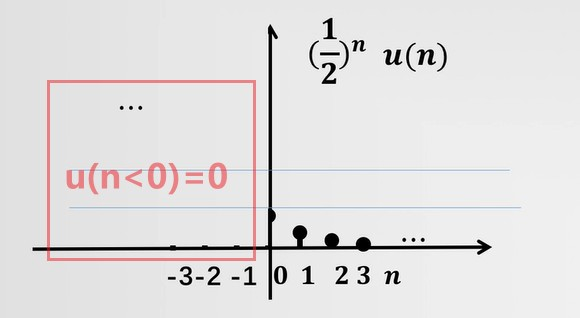
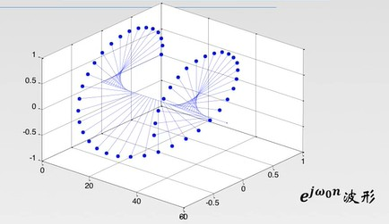
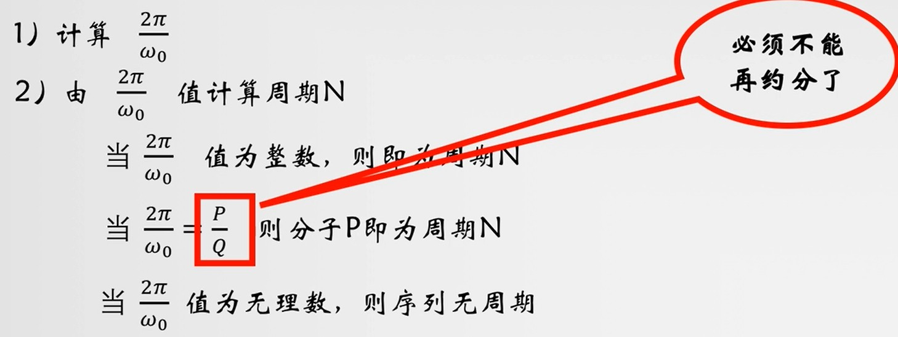

<h1>数字信号处理</h1>

*****
[toc]
*****

****
# 第一章 时域离散信号和时域离散系统

## 一、基本概念

### 1.1 时域离散信号表示

&emsp;&emsp; **驱动的变量为次数n，而非时间。**

1. **集合表示**
	$$
	x(n) = \{\underline{1},2,4,6,5,\dotsm\} \tag{1.1}
	$$

	> * n=0的样本：添加下划线
	> * 样本按照顺序排列

1. **公式**	

	$$
	x(n) = sin(\omega n), \  n为样本数
	$$

1. **图像**

### 1.2 常用信号

1. **单位脉冲序列 $\delta(n)$**
	$$
	\delta(n) = \{\dotsm,0,\underline{1},0,\dotsm\} \tag{1.2}
	$$

	

	
	
	

	 所有的数字信号，都能通过单位脉冲的缩放，偏移，叠加得到。 

1. **单位阶跃序列 $u(n)$**
	$$
	u(n) = \{\dotsm,0,\underline{1},1,1,\dotsm\} \tag{1.3}
	$$
	

	
	
	

1. ****单位矩形序列 $R_N(n)$**
	$$
	R_N(n) = \{\dotsm,0,\underline{1},1,1,\dotsm,0,0\} \tag{1.4}
	$$
	

	
	
	

1. **实指数序列 $a^n u(n)$**

	

	
	
	

	 如图，左边全为0，右边有值的序列又称之为：单边序列。 

1. **复指数序列 $e^{( \sigma + j \omega_0 )n}$**

	$$
	e^{( \sigma + j \omega_0 )n} = e^{\delta}(cos(\omega_0 n) + j sin(\omega_0 n)) \tag{1.5}
	$$

	

	
	
	

1. **正弦 $sin(\omega_0 n)$**

	

	
	
	

	 正弦的离散采样值，不一定是周期循环的。 

1. **周期序列**

	$$
	x(n) = x(n + N) ; N 是整数。\tag{1.6}
	$$

### 1.3 正弦信号求解周期

&emsp;&emsp;**当多个正弦叠加时，周期为所有正弦信号的公倍数。**

### 1.4 信号的运算 

1. **加减乘除**
	**n对齐后，直接各个对应采样值进行加减乘除**

1. **位移，翻转**
	> 位移：x(n-N)，**左加右减**
	> 翻转：x(-n)

1. **尺度变换**
	**$x(an)$ :序列x(n)每间隔a个点取一个点，构成一个新的序列。**

	

	
	
	

## 二、时域离散系统

### 2.1 时域离散系统的运算 $T[.]$ 表示

1. **加减，乘除，倍增**

	

	
	

1. **函数**

	

	
	
	

### 2.2 线性系统

* **定义：系统的输入输出之间满足线性叠加原理。**
* **判断原则：**

$$
\begin{aligned}
	设：
	y_1(n) &= T [a_1 x_1(n)] \\
	y_2(n) &= T [a_2 x_2(n)] \\
	则：
	y_1(n) + y_2(n) &= T[[a_1 x_1(n) + a_2 x_2(n)]
\end{aligned} \tag{2.1}
$$

### 2.3 时不变系统

* **定义：系统对于输入信号的运算关系在整个过程中不随时间变化。**
* **判断原则：**

$$
\begin{aligned}
	设：
	y(n) &= T [a x(n)] \\
	则：
	y(n - n_0) &= T [a x(n - n_0)]
\end{aligned} \tag{2.2}
$$

### 2.4 线性时不变系统

&emsp;&emsp;**同时满足上述的2.2和2.3的系统。**

### 2.5 单位脉冲响应

&emsp;&emsp; **系统输入$\delta(n)$时，系统输出就是单位脉冲响应。**
$$
h(n) = T [\delta(n)] \tag{2.3}
$$

### 2.6 卷积和

&emsp;&emsp;对于 **线性时不变系统** 系统的输出可以通过 **单位脉冲响应和系统输入卷积计算得到。**

$$
y(n) = x(n) * h(n) = \sum_k x(k) h(n - k) \tag{2.4}
$$

> * 交换律：a * b = b * a
> * 结合律：(a * b) * c = a * (b * c)
> * 分配律：a * (b + c) = a*b + a * c

