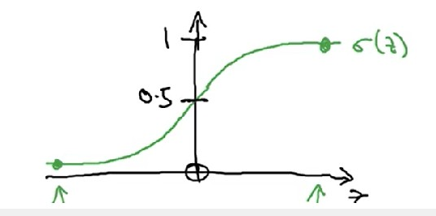
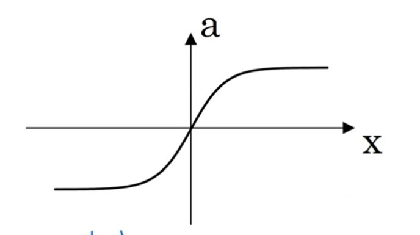
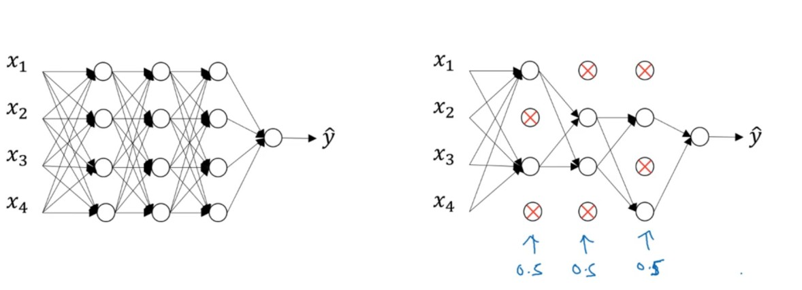

<h1>机器学习-神经网络</h1>

*****
[toc]
*****

****
# 第一章 神经网络基础

## 一、逻辑回归( Logic Regression )

### 1 问题的模型
**模型**：

$$
\left \{ 
\begin{array}{ l }
z = w^T x + b \\
\hat{y} = \sigma(z) 
\end{array}   
\right . \tag{1.1}
$$

其中$x$为输入量，$\hat{y}$预测量，$\sigma()$激活函数。
&emsp;&emsp;逻辑回归主要用于**二分类**问题的拟合：$ 0 \le \hat{y} = P(y=1 | x)  \le 1$，$\sigma(z)$如图：

<center>



</center>

**问题**：
> 对于模型$(1.1)$，需要通过一系列的样本$(x,y=\{0,1\})$，求解出系数$w,b$。

**求解**：
> **转为最优化问题，然后对未知系数进行求解**。

### 2 最优化问题求解

#### 2.1 损失函数(Loss Function)

1. 作用：
    &emsp;&emsp;用于衡量**单个样本**，在进行模型预测后 $y$ 与 $\hat{y}$ 之间的差距。
1. 二分问题的损失函数
    $$
    L(y,\hat{y}) = -(y \ln \hat{y} + (1 - y) \ln (1 - \hat{y})) \tag{2.1a}
    $$

1. 拟合问题的一般损失函数

    $$
    L(y,\hat{{y}}) = ||y-\hat{y}||^2
    $$

**注意**：
> $L()$函数应该是**凸集**，防止在寻优的过程中出现多个局部最优解。($y = x^2 $就是典型的凸集)

#### 2.2 消耗函数(Cost Function)

&emsp;&emsp;用于对**全部**的样本的预测结果进行评估。也就是最终寻优的**目标函数**。

$$
J(w,b) = \frac{1}{m} \sum_{i=1}^{m} L(y^{(i)},\hat{y}^{(i)}) \tag{2.2}
$$

#### 2.3 寻优方法

&emsp;&emsp;对于目标函数$J$使用梯度下降法进行寻优，迭代更新$(w,b)$，最终得到使得$J$最小的变量值$(w,b)$就是模型$(1.1)$的解。也就完成了对于模型的训练。

$$
\left \{ 
\begin{array}{l}
w = w - \alpha \frac{\mathrm{d} J}{\mathrm{d} w} \\
\\
b = b - \alpha \frac{\mathrm{d} J}{\mathrm{d} b}    
\end{array}
\right. \tag{2.3}
$$

## 二、浅层神经网络(Shallow Neural Network)

### 2.1 模型结构

&emsp;&emsp;BP神经网络层只有三层：Input layer，Hiden layer，Output layer；

<center>


</center>

节点的计算与逻辑回归相似。

$$
\left \{ 
\begin{array}{ l }
z^{[i]} = (w^{[i]})^T x + b^{[i]} \\
a^{[i]} = \sigma(z^{[i]}) 
\end{array}   
\right . \tag{2.4}
$$

### 2.2 激活函数

1. sigmoid

    > **二分问题，输出节点必使用sigmoid。**

    $$
    \left \{
    \begin{array}{l}
        a =\frac{1}{1+e^{-z}} \\
        \frac{\mathrm{d} a}{\mathrm{d} z} = a(1-a)
    \end{array}
    \right . \tag{2.5}
    $$
    
    <center>

    
    </center>

3. tanh (tansig)
    MATLAB中的 **tansig** 激活函数，就是tanh的化解形式。
    $$
    \left \{
    \begin{array}{l}
        a =\frac{e^z - e^{-z}}{e^z + e^{-z}}\\
        \frac{\mathrm{d} a}{\mathrm{d} z} = 1 - a^2
    \end{array}
    \right . \tag{2.6}
    $$
    
    <center>

    
    </center>

4. ReLU
    > **拟合问题，输出节点必使用ReLU**

    $$
    \left \{
    \begin{array}{l}
        a =max(0,z)\\
        \frac{\mathrm{d} a}{\mathrm{d} z} = if(z \ge 0): 1, 0
    \end{array}
    \right . \tag{2.7}
    $$
    
    <center>

    
    </center>

1. Leaking ReLU

    $$
    \left \{
    \begin{array}{l}
        a =max(0.01 z,z)\\
        \frac{\mathrm{d} a}{\mathrm{d} z} = if(z \ge 0): 1, 0.01
    \end{array}
    \right . \tag{2.7}
    $$
    
    <center>

    
    </center>

### 2.3 正向传播(frontpropagation)与反向传播(backpropagation)


1. 正向传播

    <center>

    
    </center>

2. 反向传播
    $$
    \begin{array}{l}
        d z^{[2]}=a^{[2]}-y \\
        d W^{[2]}=d z^{[2]} a^{[1]^{T}} \\
        d b^{[2]}=d z^{[2]} \\
        d z^{[1]}=W^{[2] T} d z^{[2]} * g^{[1]^{\prime}}\left(\mathrm{z}^{[1]}\right) \\
        d W^{[1]}=d z^{[1]} x^{T} \\
        d b^{[1]}=d z^{[1]}
    \end{array} \tag{2.8}
    $$

>    **注意**：
> * 代表的是：numpy.multiply()
> * **反向传播公式只适用于二分问题**

### 2.4 w系数初始化

> * 隐含层节点的**初始化值应当不同**；否则会导致节点的计算结果一样，多节点无意义。
> * **W的初始化值应当较小**；使得激活函数落在斜率大的地方，梯度下降法收敛快。

****
# 第二章 改善深层神经网络

## 一、基础理论

### 1.1 超参数
&emsp;&emsp;对于神经网络模型而言，**决定最终神经网络模型性能的系数是w和b，其余可调的系数均为超参数。**

### 1.2 训练集、测试集和开发集

&emsp;&emsp;**在模型生成的过程中，根据样本数据起到的作用，进行集合类型的划分。**
* 训练集(Train Set): 用于模型的训练。
* 开发集(Dev Set): 用于对**训练中的模型**进行测试。
* 测试集(Test Set): 用于对**最终的模型**进行测试。

> **注意**：训练集和开发集的数据应当来自于同一组样本。

### 1.3 方差(Variance)和偏差(Bias)

1. 偏差

    &emsp;&emsp;模型在样本上，输入与输出之间的误差，即模型本身的精确度。**反应在训练集上**。

1. 方差

    &emsp;&emsp;模型预测结果与输出期望之间的误差，即模型的稳定性。**反应在开发集与训练集上**。

1. 关系
    > * 低偏差|低方差：最想要的结果。
    > * 低偏差|高方差：**过拟合 (overfitting)**，对测试集和开发集拟合能力差。
    > * 高偏差：**欠拟合 (underfitting)**，模型拟合得很差。

### 1.4 过拟合与欠拟合解决方案

> **过拟合**
> * 简化模型复杂度
> * L2正则化和Dropout
> * 增加样本数量
>
> **欠拟合**
> * 使用更复杂的神经网络模型
> * 更换优化方法
> * 增加迭代训练次数

## 二、正则化（regularization）

> **作用**：降低模型的复杂度，从而防止模型的过拟合问题。

### 2.1 L2正则化

&emsp;&emsp;**在梯度下降法中**，对于目标函数J添加一个正则项：

$$
J(w,b) = \frac{1}{m} \sum_{i=1}^{m} L(y^{(i)},\hat{y}^{(i)}) + \frac{\lambda}{2m} \sum_l ||w^{[l]}||_2^2  \tag{2.1}
$$

这就会导致更新每一层的w系数时：

$$
w_{L2}^{[l]} = w^{[l]} - \alpha (\mathrm{d} w^{[l]} + \frac{\lambda}{m} w^{[l]}) \tag{2.2}
$$

增大系数$\lambda$便会使得$w^{[l]}$的值减小；**当一个神经元节点的$w \approx 0$时，该神经元节点便在模型中失效**。

<center>


</center>

### 2.2 Droput正则

&emsp;&emsp;减少一次训练样本中的节点，防止过拟合。**不依赖一个特性，将权重值分散。**

<center>


</center>

>**实现**：将$a^{[l]}$中的某些元素置为0。(inverted dropout)
>
> **注意**：
> * 经过处理后的J无明确的意义
> * 该方法主要用于图像识别

## 三、归一化(Normalize)

> **对于样本首先进行归一化处理，然后才能使用。**

### 3.1 映射到[-1,1]

正向：

$$
X_{norm} = \frac{2}{X_{max} - X_{min}} (X - X_{min})  - 1 \tag{3.1}
$$

反向：

$$
X = (X_{norm} + 1) \frac{X_{max} - X_{min}}{2} + X_{min} \tag{3.2}
$$

### 3.2 映射到[0,1]

正向：
$$
X_{norm} = \frac{X - X_{min}}{X_{max} - X_{min}}
$$

反向：

$$
X = X_{norm} (X_{max} - X_{min}) + X_{min} \tag{3.2} 
$$

## 四、系数初始化

**对于深度的神经网络**；
* 当w > 1时，从输入层到输出层，输出值将会很大
* 当w < 1时，从输入层到输出层，输出值将会很小

&emsp;&emsp;为了避免这些问题，需要对w值进行合理的初始化。即 $var(w^{[l]}) = \frac{2}{n^{[l]}},E(w^{[l]}) = 0$
$$
w^{[l]} = numpy.multiply(randn(),\sqrt{\frac{2}{n^{[l]}}})
\tag{4.1}
$$
其中$n$代表一个神经元节点输入的个数。


## 五、指数加权平均

$$
v_t = \beta v_{t - 1} + (1 - \beta) \theta_t \tag{5.1}
$$

对于$v_t$可以认为是前$\frac{1}{1 - \beta}$个v值的平均值。

&emsp;&emsp;在初始时刻，使用指数加权平均，会导致估计值偏差较大。在后期时刻，偏差就基本近似。所以可以对初期的估计值进行修正。

$$
v_t = \frac{v_t}{1 - \beta^t} \tag{5.2}
$$

## 六、Mini Batch

### 6.1 模型
&emsp;&emsp;将样本数据中的训练集再划分为多个子集，再依次利用这些子集进行模型训练。
> * 子集的样本量：$m \le 200$
> * 子集的个数：$2^i$
> * **mini batch 训练过程中，J的变化是振荡。**

<center>


</center>

### 6.2 梯度下降法

&emsp;&emsp;对于梯度下降法，**Mini Batch的(w,b)** 的变化如上图所示，是振荡的，向着最优解靠近。**在这种情形下，使用梯度下降法时，学习率$\alpha$不能太大**。

### 6.3 动量梯度下降法

&emsp;&emsp;对变量（w,b）使用 **指数加权平均** 降低振荡，使得收敛过程更加的平缓。**这样就能加大学习率$\alpha$，减少迭代次数**。

$$
\begin{array}{l}
v_{d w}=\beta v_{d w}+(1-\beta) d w \\
v_{d b}=\beta v_{d b}+(1-\beta) d b \\
w=w-\alpha v_{d w}, \quad b=b-\alpha v_{d b}
\end{array} \tag{6.1}
$$

<center>


</center>

### 6.4 RMSprop法

&emsp;&emsp;在降低振荡振幅的基础上，**还要缩短纵轴的波动，延长横轴的长度。**

$$
\begin{aligned}
    S_{dw} &= \beta S_{dw} + (1 - \beta) ( dw .*dw ) \\
    S_{db} &= \beta S_{db} + (1 - \beta) (db .* db) \\
    w &= w - \alpha \frac{dw}{\sqrt{S_{dw} + \epsilon}} \\
    b &= b - \alpha \frac{dw}{\sqrt{S_{db} + \epsilon}}
\end{aligned} \tag{6.2}
$$

其中$\epsilon$是一个很小的值，防止$S$为0，造成运算异常。

### 6.5 ADAM法

&emsp;&emsp;对RMSprop法和动量法的整合，改进。

$$
\begin{aligned}
    v_{d w} &= \beta_1 v_{d w}+(1-\beta_1) d w \\
    v_{d b} &= \beta_1 v_{d b}+(1-\beta_1) d b \\
    S_{dw} &= \beta_2 S_{dw} + (1 - \beta_2) ( dw .*dw ) \\
    S_{db} &= \beta_2 S_{db} + (1 - \beta_2) (db .* db) \\
    v_{dw}^{corre} &= \frac{v_{dw}}{1 - \beta_1^t} \\
    v_{db}^{corre} &= \frac{v_{db}}{1 - \beta_1^t} \\
    S_{dw}^{corre} &= \frac{S_{dw}}{1 - \beta_2^t} \\
    S_{db}^{corre} &= \frac{S_{db}}{1 - \beta_2^t} \\
    w &= w - \alpha \frac{ v_{dw}^{corre}}{\sqrt{S_{dw}^{corre} + \epsilon}} \\
    b &= b - \alpha \frac{v_{db}^{corre}}{\sqrt{S_{db}^{corre} + \epsilon}} \\
    \beta_1 &= 0.9 \\
    \beta_2 &= 0.999 
\end{aligned} \tag{6.3}
$$

## 七、衰减学习率

&emsp;&emsp;在训练的前期使用较大的学习率，在快要收敛时，使用较小的学习率。

$$
\alpha = \frac{1}{1 + delayRate * epochNum} \alpha_0 \tag{7.1}
$$

## 八，超参数取值

* 采用枚举法，在一个区间内随机试；
* 对数标尺随机数的实现
    &emsp;&emsp;从[0.001,1]之间的对数标尺随机数的实现：

    ```python
        r = -4 * np.randm.rand()
        a = 10 ** r
    ```

## 九，Batch Norm

### 9.1 原理

&emsp;&emsp;对一个batch样本在一个神经元节点中的所有$z^{[i]}_j$进行Z标准化处理，然后再带入激活函数，求解$a^{[i]}_j$。

<center>


</center>

$$
\left \{
\begin{aligned}
    \mu &= \frac{1}{m} \sum_i z^{ (i) }, \delta^2 = \frac{1}{m} \sum_i (z^{ (i) } - \mu)^2 \\
    z_{norm}^{(i)} &= \frac{z^{ (i) } - \mu}{\sqrt{\delta^2 + \epsilon}} \\
    \hat{z}^{(i)} &= \gamma z_{norm}^{(i)} + \beta
\end{aligned}
\right . \tag{9.1}
$$

> **注意：**
> 1. 由于对$z^{(i)}$进行了标准化处理，对于系数$b^{[i]}$将没有实质意义，可以从网络中去掉；
> 1. 引入两个调节参数$\beta^{[i]},\gamma^{[i]}$。

### 9.2 $\mu ,\delta$的获取

1. 训练集：直接使用min-batch中的所有样本进行计算从而获取。
2. 测试集：将训练集中计算得到的 $\mu^{\{i\}},\delta^{\{i\}}$进行指数平均获取到的$\mu,\delta$用于测试计算。

### 9.3 covariate shift

<center>


</center>

&emsp;&emsp;对于第3，4层神经网络而言，它们以$a^{[2]}$作为样本输入（就认为是样本定值），从而实现结果向$\hat{y}$靠拢。但是从整体网络上来看$a^{[2]}$受到了第1，2层网络的影响，是变化的。因此，对于$a^{[2]}$就存在**协变量偏移**的情况。**Batch Norm的作用就是将每一个神经元激活前的样本尽可能都保持在统一的一个分布内。**

## 十、softmax回归

### 10.1 作用

> 可以对种数据类型的学习，实现多类型划分。

### 10.2 原理
1. 激活函数
    <center>

    

    </center>

    &emsp;&emsp;**输出层的节点数量=类别的数量，并且输出层的激活函数为softmax激活函数。**

    $$
    \left \{
    \begin{aligned}
        z^{[L]} &= w^{[L]}a^{[L-1]} + b^{[L]} \\
        t &= e^{z^{[L]}} \\
        \hat{y} &= \left [ \frac{ t_i }{\sum t_i}  \right ]
    \end{aligned}
    \right . \tag{10.1}
    $$

    其中：
    &emsp;&emsp;$\hat{y}$各个输出量的总和为1。输出结果就是样本在各个分类所占的概率。

1. 损失函数
    $$
    L(\hat{y},y) = - \sum ^C_i y_i \log{\hat{y}_i} \tag{10.2}
    $$    

1. 目标函数
    $$
    J = \frac{1}{m} \sum^m_i L(\hat{y}^{(i)},y^{(i)}) \tag{10.3}
    $$    

****
# 附录
## 符号约定

1. 单样本表示

    $x$为$n$维的输入；$y$为[是|否]。

    $$
    (x,y) \qquad x \in R^{n},y \in {0,1} \tag{1}
    $$

    $x$为$n_x$维的输入；$y$为$n_y$维度输出。

    $$
    (x,y) \qquad x \in R^{n_x},y \in R^{n_y} \tag{2}
    $$

1. 多样本表示

    $m$个$n_x$维的$X$

    $$
    X = \begin{bmatrix}
        \big | & \big | & \dotsm & \big | \\
        x^{(1)}  & x^{(2)} & \dotsm & x^{(m)} \\
        \big | & \big | & \dotsm & \big | \\
    \end{bmatrix} \tag{3}
    $$

    $m$个$n_y$维的$Y$

    $$
    Y = \left [ y^{(1)} \quad y^{(2)} \quad \dotsm \quad y^{(m)} \right ] \tag{4}
    $$

1. 上标$(i)$

    与第$i$个样本有关： $ z^{(i)} = w^T x^{(i)} + b$

1. 上标$[i]$

    与第$i$层神经元有关：$w^{[i]},b^{[i]}$

1. 上标$\{i\}$
    
    某个集合的子集：$x=[x_1,x_2,\dotsm,x_m],x^{\{1\}} = [x_1,x_2]$

1. 导数 $\mathrm{d} var$

    表示目标$J$关于变量$var$的导数

    $$
    \mathrm{d} var = \frac{\mathrm{d} J}{\mathrm{d} var} \tag{5}
    $$

1. i层的输出l

    a: active；表示激活函数的输出。
    $$
    a^{[i]} \tag{6}
    $$