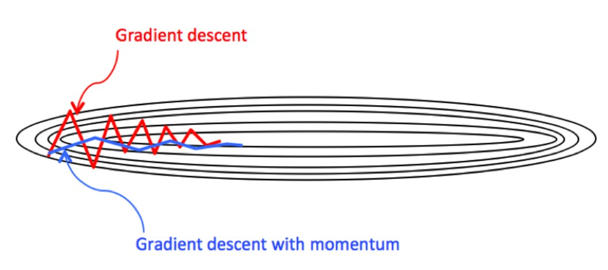
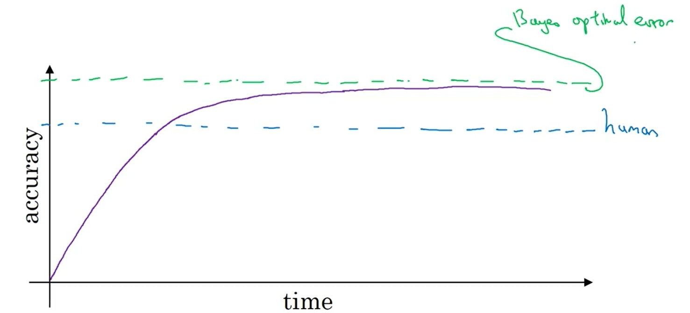
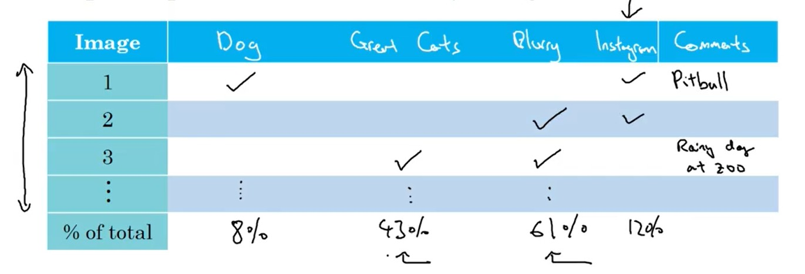
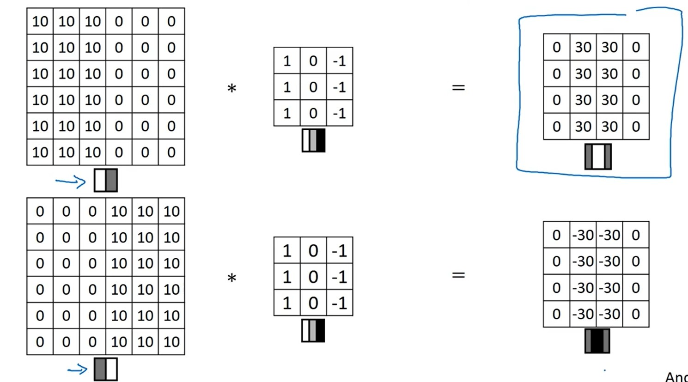
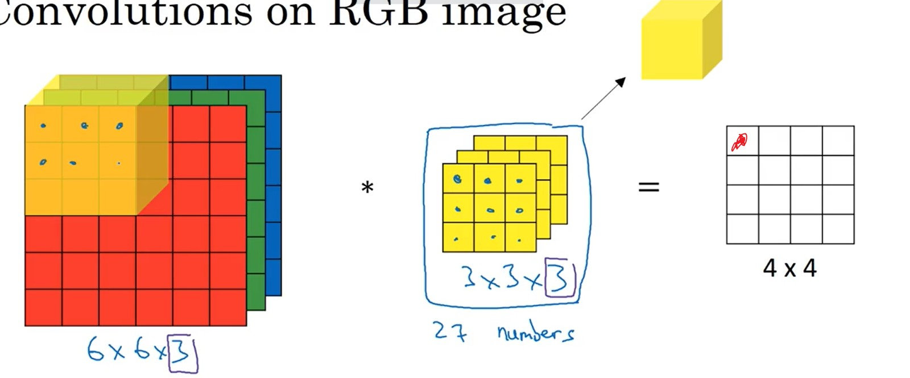
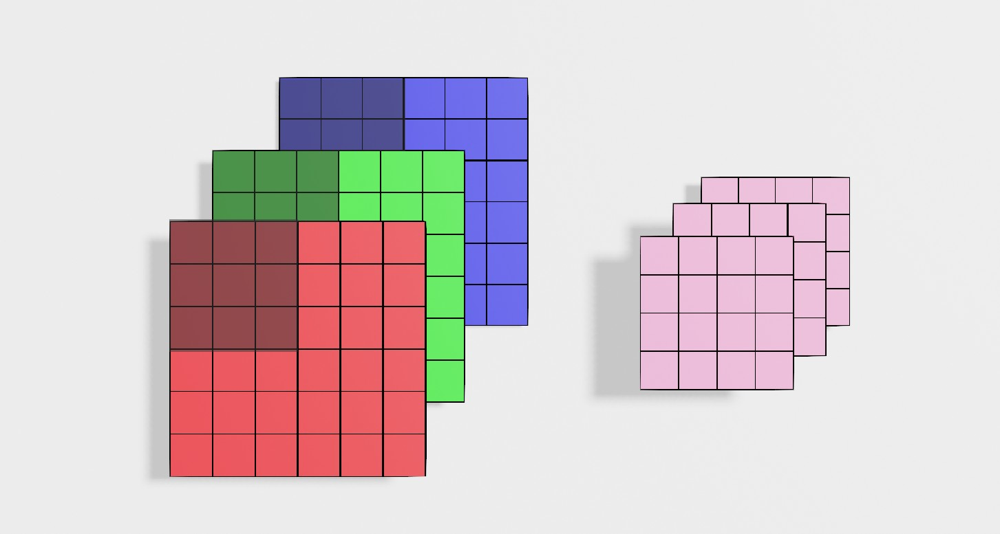
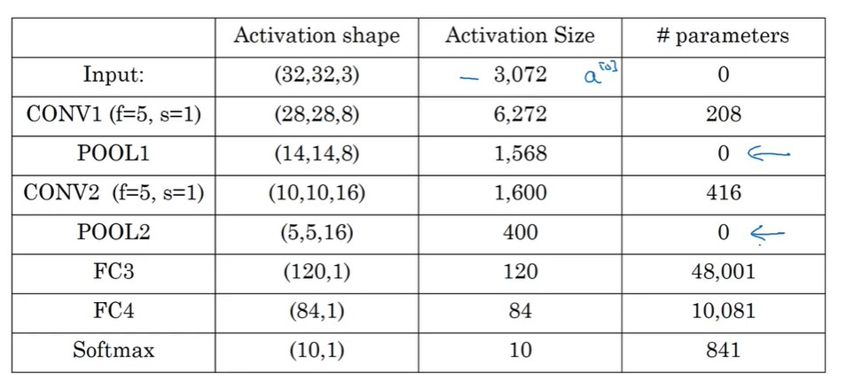

<h1>机器学习-神经网络</h1>

*****
[toc]
*****

****
# 第一章 神经网络基础

## 一、逻辑回归( Logic Regression )

### 1 问题的模型
**模型**：

$$
\left \{ 
\begin{array}{ l }
z = w^T x + b \\
\hat{y} = \sigma(z) 
\end{array}   
\right . \tag{1.1}
$$

其中$x$为输入量，$\hat{y}$预测量，$\sigma()$激活函数。
&emsp;&emsp;逻辑回归主要用于**二分类**问题的拟合：$ 0 \le \hat{y} = P(y=1 | x)  \le 1$，$\sigma(z)$如图：

<center>


</center>

**问题**：
> 对于模型$(1.1)$，需要通过一系列的样本$(x,y=\{0,1\})$，求解出系数$w,b$。

**求解**：
> **转为最优化问题，然后对未知系数进行求解**。

### 2 最优化问题求解

#### 2.1 损失函数(Loss Function)

1. 作用：
    &emsp;&emsp;用于衡量**单个样本**，在进行模型预测后 $y$ 与 $\hat{y}$ 之间的差距。
1. 二分问题的损失函数
    $$
    L(y,\hat{y}) = -(y \ln \hat{y} + (1 - y) \ln (1 - \hat{y})) \tag{2.1a}
    $$

1. 拟合问题的一般损失函数

    $$
    L(y,\hat{{y}}) = ||y-\hat{y}||^2
    $$

**注意**：
> $L()$函数应该是**凸集**，防止在寻优的过程中出现多个局部最优解。($y = x^2 $就是典型的凸集)

#### 2.2 消耗函数(Cost Function)

&emsp;&emsp;用于对**全部**的样本的预测结果进行评估。也就是最终寻优的**目标函数**。

$$
J(w,b) = \frac{1}{m} \sum_{i=1}^{m} L(y^{(i)},\hat{y}^{(i)}) \tag{2.2}
$$

#### 2.3 寻优方法

&emsp;&emsp;对于目标函数$J$使用梯度下降法进行寻优，迭代更新$(w,b)$，最终得到使得$J$最小的变量值$(w,b)$就是模型$(1.1)$的解。也就完成了对于模型的训练。

$$
\left \{ 
\begin{array}{l}
w = w - \alpha \frac{\mathrm{d} J}{\mathrm{d} w} \\
\\
b = b - \alpha \frac{\mathrm{d} J}{\mathrm{d} b}    
\end{array}
\right. \tag{2.3}
$$

## 二、浅层神经网络(Shallow Neural Network)

### 2.1 模型结构

&emsp;&emsp;BP神经网络层只有三层：Input layer，Hiden layer，Output layer；

<center>


</center>

节点的计算与逻辑回归相似。

$$
\left \{ 
\begin{array}{ l }
z^{[i]} = (w^{[i]})^T x + b^{[i]} \\
a^{[i]} = \sigma(z^{[i]}) 
\end{array}   
\right . \tag{2.4}
$$

### 2.2 激活函数

1. sigmoid

    > **二分问题，输出节点必使用sigmoid。**

    $$
    \left \{
    \begin{array}{l}
        a =\frac{1}{1+e^{-z}} \\
        \frac{\mathrm{d} a}{\mathrm{d} z} = a(1-a)
    \end{array}
    \right . \tag{2.5}
    $$
    
    <center>

    
    </center>

3. tanh (tansig)
    MATLAB中的 **tansig** 激活函数，就是tanh的化解形式。
    $$
    \left \{
    \begin{array}{l}
        a =\frac{e^z - e^{-z}}{e^z + e^{-z}}\\
        \frac{\mathrm{d} a}{\mathrm{d} z} = 1 - a^2
    \end{array}
    \right . \tag{2.6}
    $$
    
    <center>

    
    </center>

4. ReLU
    > **拟合问题，输出节点必使用ReLU**

    $$
    \left \{
    \begin{array}{l}
        a =max(0,z)\\
        \frac{\mathrm{d} a}{\mathrm{d} z} = if(z \ge 0): 1, 0
    \end{array}
    \right . \tag{2.7}
    $$
    
    <center>

    
    </center>

1. Leaking ReLU

    $$
    \left \{
    \begin{array}{l}
        a =max(0.01 z,z)\\
        \frac{\mathrm{d} a}{\mathrm{d} z} = if(z \ge 0): 1, 0.01
    \end{array}
    \right . \tag{2.7}
    $$
    
    <center>

    
    </center>

### 2.3 正向传播(frontpropagation)与反向传播(backpropagation)


1. 正向传播

    <center>

    
    </center>

2. 反向传播
    $$
    \begin{array}{l}
        d z^{[2]}=a^{[2]}-y \\
        d W^{[2]}=d z^{[2]} a^{[1]^{T}} \\
        d b^{[2]}=d z^{[2]} \\
        d z^{[1]}=W^{[2] T} d z^{[2]} * g^{[1]^{\prime}}\left(\mathrm{z}^{[1]}\right) \\
        d W^{[1]}=d z^{[1]} x^{T} \\
        d b^{[1]}=d z^{[1]}
    \end{array} \tag{2.8}
    $$

>    **注意**：
> * 代表的是：numpy.multiply()
> * **反向传播公式只适用于二分问题**

### 2.4 w系数初始化

> * 隐含层节点的**初始化值应当不同**；否则会导致节点的计算结果一样，多节点无意义。
> * **W的初始化值应当较小**；使得激活函数落在斜率大的地方，梯度下降法收敛快。

****
# 第二章 改善深层神经网络

## 一、基础理论

### 1.1 超参数
&emsp;&emsp;对于神经网络模型而言，**决定最终神经网络模型性能的系数是w和b，其余可调的系数均为超参数。**

### 1.2 训练集、测试集和开发集

&emsp;&emsp;**在模型生成的过程中，根据样本数据起到的作用，进行集合类型的划分。**
* 训练集(Train Set): 用于模型的训练。
* 开发集(Dev Set): 用于对**训练中的模型**进行测试。
* 测试集(Test Set): 用于对**最终的模型**进行测试。

> **注意**：训练集和开发集的数据应当来自于同一组样本。

### 1.3 方差(Variance)和偏差(Bias)

1. 偏差

    &emsp;&emsp;模型在样本上，输入与输出之间的误差，即模型本身的精确度。**反应在训练集上**。

1. 方差

    &emsp;&emsp;模型预测结果与输出期望之间的误差，即模型的稳定性。**反应在开发集与训练集上**。

1. 关系
    > * 低偏差|低方差：最想要的结果。
    > * 低偏差|高方差：**过拟合 (overfitting)**，对测试集和开发集拟合能力差。
    > * 高偏差：**欠拟合 (underfitting)**，模型拟合得很差。

### 1.4 过拟合与欠拟合解决方案

> **过拟合**
> * 简化模型复杂度
> * L2正则化和Dropout
> * 增加样本数量
>
> **欠拟合**
> * 使用更复杂的神经网络模型
> * 更换优化方法
> * 增加迭代训练次数

## 二、正则化（regularization）

> **作用**：降低模型的复杂度，从而防止模型的过拟合问题。

### 2.1 L2正则化

&emsp;&emsp;**在梯度下降法中**，对于目标函数J添加一个正则项：

$$
J(w,b) = \frac{1}{m} \sum_{i=1}^{m} L(y^{(i)},\hat{y}^{(i)}) + \frac{\lambda}{2m} \sum_l ||w^{[l]}||_2^2  \tag{2.1}
$$

这就会导致更新每一层的w系数时：

$$
w_{L2}^{[l]} = w^{[l]} - \alpha (\mathrm{d} w^{[l]} + \frac{\lambda}{m} w^{[l]}) \tag{2.2}
$$

增大系数$\lambda$便会使得$w^{[l]}$的值减小；**当一个神经元节点的$w \approx 0$时，该神经元节点便在模型中失效**。

<center>


</center>

### 2.2 Droput正则

&emsp;&emsp;减少一次训练样本中的节点，防止过拟合。**不依赖一个特性，将权重值分散。**

<center>


</center>

>**实现**：将$a^{[l]}$中的某些元素置为0。(inverted dropout)
>
> **注意**：
> * 经过处理后的J无明确的意义
> * 该方法主要用于图像识别

## 三、归一化(Normalize)

> **对于样本首先进行归一化处理，然后才能使用。**

### 3.1 映射到[-1,1]

正向：

$$
X_{norm} = \frac{2}{X_{max} - X_{min}} (X - X_{min})  - 1 \tag{3.1}
$$

反向：

$$
X = (X_{norm} + 1) \frac{X_{max} - X_{min}}{2} + X_{min} \tag{3.2}
$$

### 3.2 映射到[0,1]

正向：
$$
X_{norm} = \frac{X - X_{min}}{X_{max} - X_{min}}
$$

反向：

$$
X = X_{norm} (X_{max} - X_{min}) + X_{min} \tag{3.2} 
$$

## 四、系数初始化

**对于深度的神经网络**；
* 当w > 1时，从输入层到输出层，输出值将会很大
* 当w < 1时，从输入层到输出层，输出值将会很小

&emsp;&emsp;为了避免这些问题，需要对w值进行合理的初始化。即 $var(w^{[l]}) = \frac{2}{n^{[l]}},E(w^{[l]}) = 0$
$$
w^{[l]} = numpy.multiply(randn(),\sqrt{\frac{2}{n^{[l]}}})
\tag{4.1}
$$
其中$n$代表一个神经元节点输入的个数。


## 五、指数加权平均

$$
v_t = \beta v_{t - 1} + (1 - \beta) \theta_t \tag{5.1}
$$

对于$v_t$可以认为是前$\frac{1}{1 - \beta}$个v值的平均值。

&emsp;&emsp;在初始时刻，使用指数加权平均，会导致估计值偏差较大。在后期时刻，偏差就基本近似。所以可以对初期的估计值进行修正。

$$
v_t = \frac{v_t}{1 - \beta^t} \tag{5.2}
$$

## 六、Mini Batch

### 6.1 模型
&emsp;&emsp;将样本数据中的训练集再划分为多个子集，再依次利用这些子集进行模型训练。
> * 子集的样本量：$m \le 200$
> * 子集的个数：$2^i$
> * **mini batch 训练过程中，J的变化是振荡。**

<center>


</center>

### 6.2 梯度下降法

&emsp;&emsp;对于梯度下降法，**Mini Batch的(w,b)** 的变化如上图所示，是振荡的，向着最优解靠近。**在这种情形下，使用梯度下降法时，学习率$\alpha$不能太大**。

### 6.3 动量梯度下降法

&emsp;&emsp;对变量（w,b）使用 **指数加权平均** 降低振荡，使得收敛过程更加的平缓。**这样就能加大学习率$\alpha$，减少迭代次数**。

$$
\begin{array}{l}
v_{d w}=\beta v_{d w}+(1-\beta) d w \\
v_{d b}=\beta v_{d b}+(1-\beta) d b \\
w=w-\alpha v_{d w}, \quad b=b-\alpha v_{d b}
\end{array} \tag{6.1}
$$

<center>


</center>

### 6.4 RMSprop法

&emsp;&emsp;在降低振荡振幅的基础上，**还要缩短纵轴的波动，延长横轴的长度。**

$$
\begin{aligned}
    S_{dw} &= \beta S_{dw} + (1 - \beta) ( dw .*dw ) \\
    S_{db} &= \beta S_{db} + (1 - \beta) (db .* db) \\
    w &= w - \alpha \frac{dw}{\sqrt{S_{dw} + \epsilon}} \\
    b &= b - \alpha \frac{dw}{\sqrt{S_{db} + \epsilon}}
\end{aligned} \tag{6.2}
$$

其中$\epsilon$是一个很小的值，防止$S$为0，造成运算异常。

### 6.5 ADAM法

&emsp;&emsp;对RMSprop法和动量法的整合，改进。

$$
\begin{aligned}
    v_{d w} &= \beta_1 v_{d w}+(1-\beta_1) d w \\
    v_{d b} &= \beta_1 v_{d b}+(1-\beta_1) d b \\
    S_{dw} &= \beta_2 S_{dw} + (1 - \beta_2) ( dw .*dw ) \\
    S_{db} &= \beta_2 S_{db} + (1 - \beta_2) (db .* db) \\
    v_{dw}^{corre} &= \frac{v_{dw}}{1 - \beta_1^t} \\
    v_{db}^{corre} &= \frac{v_{db}}{1 - \beta_1^t} \\
    S_{dw}^{corre} &= \frac{S_{dw}}{1 - \beta_2^t} \\
    S_{db}^{corre} &= \frac{S_{db}}{1 - \beta_2^t} \\
    w &= w - \alpha \frac{ v_{dw}^{corre}}{\sqrt{S_{dw}^{corre} + \epsilon}} \\
    b &= b - \alpha \frac{v_{db}^{corre}}{\sqrt{S_{db}^{corre} + \epsilon}} \\
    \beta_1 &= 0.9 \\
    \beta_2 &= 0.999 
\end{aligned} \tag{6.3}
$$

## 七、衰减学习率

&emsp;&emsp;在训练的前期使用较大的学习率，在快要收敛时，使用较小的学习率。

$$
\alpha = \frac{1}{1 + delayRate * epochNum} \alpha_0 \tag{7.1}
$$

## 八，超参数取值

* 采用枚举法，在一个区间内随机试；
* 对数标尺随机数的实现
    &emsp;&emsp;从[0.001,1]之间的对数标尺随机数的实现：

    ```python
        r = -4 * np.randm.rand()
        a = 10 ** r
    ```

## 九，Batch Norm

### 9.1 原理

&emsp;&emsp;对一个batch样本在一个神经元节点中的所有$z^{[i]}_j$进行Z标准化处理，然后再带入激活函数，求解$a^{[i]}_j$。

<center>


</center>

$$
\left \{
\begin{aligned}
    \mu &= \frac{1}{m} \sum_i z^{ (i) }, \delta^2 = \frac{1}{m} \sum_i (z^{ (i) } - \mu)^2 \\
    z_{norm}^{(i)} &= \frac{z^{ (i) } - \mu}{\sqrt{\delta^2 + \epsilon}} \\
    \hat{z}^{(i)} &= \gamma z_{norm}^{(i)} + \beta
\end{aligned}
\right . \tag{9.1}
$$

> **注意：**
> 1. 由于对$z^{(i)}$进行了标准化处理，对于系数$b^{[i]}$将没有实质意义，可以从网络中去掉；
> 1. 引入两个调节参数$\beta^{[i]},\gamma^{[i]}$。

### 9.2 $\mu ,\delta$的获取

1. 训练集：直接使用min-batch中的所有样本进行计算从而获取。
2. 测试集：将训练集中计算得到的 $\mu^{\{i\}},\delta^{\{i\}}$进行指数平均获取到的$\mu,\delta$用于测试计算。

### 9.3 covariate shift

<center>


</center>

&emsp;&emsp;对于第3，4层神经网络而言，它们以$a^{[2]}$作为样本输入（就认为是样本定值），从而实现结果向$\hat{y}$靠拢。但是从整体网络上来看$a^{[2]}$受到了第1，2层网络的影响，是变化的。因此，对于$a^{[2]}$就存在**协变量偏移**的情况。**Batch Norm的作用就是将每一个神经元激活前的样本尽可能都保持在统一的一个分布内。**

## 十、softmax回归

### 10.1 作用

> 可以对种数据类型的学习，实现多类型划分。

### 10.2 原理
1. 激活函数
    <center>

    

    </center>

    &emsp;&emsp;**输出层的节点数量=类别的数量，并且输出层的激活函数为softmax激活函数。**

    $$
    \left \{
    \begin{aligned}
        z^{[L]} &= w^{[L]}a^{[L-1]} + b^{[L]} \\
        t &= e^{z^{[L]}} \\
        \hat{y} &= \left [ \frac{ t_i }{\sum t_i}  \right ]
    \end{aligned}
    \right . \tag{10.1}
    $$

    其中：
    &emsp;&emsp;$\hat{y}$各个输出量的总和为1。输出结果就是样本在各个分类所占的概率。

1. 损失函数
    $$
    L(\hat{y},y) = - \sum ^C_i y_i \log{\hat{y}_i} \tag{10.2}
    $$    

1. 目标函数
    $$
    J = \frac{1}{m} \sum^m_i L(\hat{y}^{(i)},y^{(i)}) \tag{10.3}
    $$    

### 10.3 输出($y$)编码 

1. 顺序编码
    对于结果按照数字顺序分类。
    $$
    \begin{array}{c}
        \left [ A \quad B  \quad C \quad D \right] \\ 
        \left [ 1 \quad 2  \quad 3 \quad 4 \right] 
    \end{array}
    $$

1. one-hot 编码
    $$
    \begin{array}{c}
        A = \left [ 1 \quad 0  \quad 0 \quad 0 \right] \\
        B = \left [ 0 \quad 1  \quad 0 \quad 0 \right] \\
        C = \left [ 0 \quad 0  \quad 1 \quad 0 \right] \\
        D = \left [ 0 \quad 0  \quad 0 \quad 1 \right] \\
    \end{array}
    $$

---
# 第三章 结构化机器学习策略

## 一、正交化（orthogonalization）
&emsp;&emsp;**正交化：每次调整的选项最好只影响一个阶段，尽量不要影响其他阶段。**

对于模型训练遇到的问题可以分四个阶段：
1. **首先，确保训练集的结果能达到human-level**
    > 1. 扩大模型的规模
    > 1. 更换训练方法
2. **其次，开发集的结果能够让人接收**
    > 1. 添加正则
    > 1. 增加训练数据量
3. **然后，测试集的结果能达到目标**
    > 1. 更大的训练数据量
4. **最后，模型正式使用没问题**
    > 1. 修改cost Function
    > 1. 修改指标

## 二、评价指标

&emsp;&emsp;**评价指标是在对模型各个阶段的结果进行评价，不是cost function。**

### 2.1 单一评价指标

&emsp;&emsp;**评价结果好坏的标准应当体现在最终的一个值上（多个评价指标也要规划成一个指标），方便人做出判断，避免选择综合症。**

1. F1 分数（调和评价）

    查全率（recall）：分辨出的猫的数量 / 猫的总量
    查准率（precision）：分类正确的量 / 总的样本量

    $$
        F1 = \frac{2}{\frac{1}{P} + \frac{1}{R}} \tag{2.1}
    $$

2. 加权平均

### 2.2 满足和优化指标

&emsp;&emsp;当单一评价指标不能对训练目标进行很好描述时，可以使用 **满足（satisfacting metrics）+ 优化（optimizing metrics）**。 将所有涉及的指标描述成一个**带约束的优化问题**，这样就又能形成一个单一的指标。

> optimizing metrics : 主要优化的目标。
> satisfacing metrics : 其余指标的约束条件。

### 2.3 什么时候应当调整指标

&emsp;&emsp;**当前的模型指标产生的结果，偏离了或者不满足正式使用的需求，就得马上更改。**

## 三、Human-level

### 3.1 自然感知问题（natural perception problem）

&emsp;&emsp;自然感知类问题：就是人类能根据自身经验做出判断的问题。例如：图像识别，语言识别，给人看病。。。

<center>


</center>

> 1. 在人类的水平（human-level）以下，精度上升很快，当超过人类水平，速度缓慢，逐渐收敛
> 1. 理论上模型能达到的最高精度称之为 **贝叶斯最优估计（Bayes optimal error）** 
> 1. **对于自然感知类问题，人类水平基本上靠近贝叶斯估计，也会直接用人类水平代替贝叶斯估计。**
> 1. **对于模型指标低于人类水平，上面所述的方法有效；当超过人类水平，上面所述的方法可能就效果不明显了。**

#### 3.1.1 可避免偏差(avoidable Bias)

<center>


</center>

&emsp;&emsp;**以human-level为基准，来进行偏差和方差分析（分析方法同上一章），然后在采用不同的方法来优化模型训练。**

$$
avoidable Bias = training error - human-level \tag{3.1}
$$

$$
variance = dev error - training error \tag{3.2}
$$

#### 3.1.2 human-level取值

&emsp;&emsp;human-level的取值应当根据具体的问题要求进行选择。

### 3.2 超人类水平问题（surpassses human-level）

&emsp;&emsp;超人类水平问题：模型的表现远远超过超人类水平的问题，例如广告分析，由A到B汽车行驶时间等等。 **对于这些问题的表现超出人的表现，主要是因为模型训练涉及到了大量数据的处理。对于这些问题以人类水平作为基础的模型训练方案就不再适用了。**

## 四、错误分析

<center>


</center>

&emsp;&emsp;当发现开发集，训练集的指标结果很差劲，可以对 **开发集识别错误的样本进行人工分析**。
> 1. 将所有**猜想的导致错误的原因** 列向标出；所有 **错误的样本** 在横向列出
> 1. **人工逐列分析各个样本错误的原因，并统计**
> 1. **最后分析结果，确定优化的方向。**

## 五、样本的结论存在问题

### 5.1 问题分析
&emsp;&emsp;对于收集的样本，如果**只是一小部分**输入x与输入y之间的对应关系存在问题：
> 训练集：一般不用修改这些错误，因为训练集样本量大，且算法具有鲁棒性。
> 开发集：首先进行 **错误分析** ，问题样本导致的误差挺大的，就要修正开发集。

### 5.2 问题修正
&emsp;&emsp;当发现问题很严重时，需要就行样本修正：
> * **修正后，保证开发集和测试集的分布一致性。**
> * **也要尽量去检验那些 <span style="color:red;font-weight:bold"> 侥幸计算对的样本 </span>**
> * **修复了开发集和测试集，可能导致与训练集的分布不统一**

## 六、训练的起步

* <span style="color:red;font-weight:bold"> 先搭建一个简单的模型，不用想太多 </span>

* <span style="color:red;font-weight:bold"> 进行样本错误分析与各个集的误差分析，确定模型优化方向 </span>

## 七、训练集与开发集，测试集分布不同

### 7.1 实践样本太少的样本划分

&emsp;&emsp;当模型实际应用的样本太少或者不好获取时，对于样本的分布就不能在采用训练集，开发集，测试集样本均匀分布的方案，**应当将实践样本全划分到开发集和测试集，让模型训练是朝着期望走。**

### 7.2 数据不匹配判别及处理

&emsp;&emsp;**数据不匹配问题：由于开发集，测试集同训练集的分布不同，可能会导致训练的模型不能达到我们的预期。** 为了观测出 **是不是由于这问题导致了模型的不准确** 又引入了一个 **训练-开发集：该集合的样本分布与训练集相同。**

<center>


</center>

&emsp;&emsp;**当 dev error 相对于 train-dev error 比较大时，就存在数据不匹配问题。**
> * 对比训练集样本与实际样本之间的差别
> * 增加实际情况的样本数据
> * 人工制造实际情况样本数据，尽量增加数据的多样性（**可能会导致对单一情况的过拟合**）

## 八、迁移学习

<center>


</center>

&emsp;&emsp;**迁移学习：继承其他已经成功的模型，来继续训练当前的模型。**

> * **A模型的x与B模型的x相同**
> * **A模型训练的样本量 相对于 B模型的样本量大的多。**
> * **A模型最开始的几层网络能提升B模型性能的可能性最大：模型从后向前进行修改。**

## 九、多任务学习

&emsp;&emsp;**多任务学习：将多个训练目的全放到一个模型中进行训练。** 对于无人驾驶而言，可以把识别人，车，路标等功能都集成到一个模型中进行训练。
> * 多个任务可以共用一套浅层的网络
> * **多个任务分开时，样本量应当能保证大体一致，数量平均**
> * **当效果不好时，主要因素是网络结构太小**
> * **softmax: 分辨的是什么。多任务学习：分辨的是有什么**

## 十、端对端学习

<center>


</center>

&emsp;&emsp;**直接使用x映射到y，进行神经网络学习，中间不做任何的内容处理，完全的黑箱。**

> 好处：
>> 1. 模型完全依赖数据
>> 1. 在x -> y的过程中，不用再考虑添加其他处理流程。
>
> 坏处：
>> 1. 一般需要大量的数据才能出效果
>> 1. 人工控制降低

***
# 第四章 卷积神经网络

## 一、卷积计算

<center>


</center>

&emsp;&emsp; 输入图片（6x6）与过滤器（3x3）进行矩阵的卷积计算，得到输出（4x4）。

输出纬度的计算：
$$
n_o = \lfloor \frac{n_{i} + 2p - f}{s} + 1\rfloor \tag{1.1}
$$

> f : 过滤器的纬度 
> p : 输入图片填充的像素
> s : 过滤器在输入图像上移动的步长
> **当步长s不为1时，可能导致过滤器越界，所以使用floor进行向下取整。**

&emsp;&emsp; <span style="color:orange;font-weight:bold"> 在图像识别中所说的“卷积”和实际定义有一点小差别，图像识别省略了：对过滤器进行右对角线的翻转（对结果没啥影响，没必要算了）。图像识别中的卷积准确应当称之为：cross-correlation。 </span>

## 二、过滤器边缘监测
<center>


</center>

&emsp;&emsp;定义一个竖向的过滤器，就能实现对竖向的边缘进行监测；同样定义一个横向的过滤器，就能对一个横向的边缘进行监测。对于过滤器的值，可以自定义，不用完全是-1或者1。**因此，卷积神经网络就直接将过滤器中的所有系数，都设置为w系数。**

## 三、Padding

&emsp;&emsp;进行卷积计算后，原来的图像会被缩小，为了规避这个问题，可以将原来的图像的进行边缘扩充像素。根据公式（1.1）就能将卷积后的图像尺寸保持得和输入图像一样大。

## 四、三维卷积

<center>


</center>

&emsp;&emsp;**输入的通道数和过滤器的通道数相同，才能进行计算。**

## 五、一层网络

<center>


</center>

&emsp;&emsp; **一张图像通过两个滤波器，计算得到两层；在将两层送入激活函数；最后将两个层重合得到输出。**

$$
    a^{[l]} = active(input * filter + bias)  \tag{5.1}
$$

## 六、池化（pooling）

<center>


</center>

&emsp;&emsp;<span style="color:blue;font-weight:bold"> 不同于卷积，池化的作用是将原来的像素，按照块操作，进行压缩处理。</span> **根据压缩数据方式的不同分为：1）max pooling，区域内的最大值；2）average pooling，区域求平均值。**

$$
n_o = \lfloor \frac{n_{i} - f}{s} + 1\rfloor \tag{6.1}
$$

<center>


</center>

> * **对于pooling的计算，是每一个通道进行一次计算，输出结果通道数不改变。**
> * **pooling涉及的超参数，训练集训练时就是为常量。**

## 七、卷积神经网络模型

<center>


</center>

> * **图像刚输入的时候，靠卷积和池化降低参数数量。**
> * **输出就是靠全连接网络（BP网络）和分类器获取估计结果。**

## 八、卷积的作用

<center>


</center>

&emsp;&emsp;<span style="color:blue;font-weight:bold"> 与普通神经网络相比，卷积网络大大降低了超参数的量，实现了对图像像素的压缩和特征提取。</span>

> * **parameter sharing**：用于一次过滤的过滤器都是一样的，数据处理过程统一，也降低了超参数的量。
> * **sparsity of connection**：每个像素只能影响局部的结果，符合常规认知。

****
# 附录
## 符号约定

1. 单样本表示

    $x$为$n$维的输入；$y$为[是|否]。

    $$
    (x,y) \qquad x \in R^{n},y \in {0,1} \tag{1}
    $$

    $x$为$n_x$维的输入；$y$为$n_y$维度输出。

    $$
    (x,y) \qquad x \in R^{n_x},y \in R^{n_y} \tag{2}
    $$

1. 多样本表示

    $m$个$n_x$维的$X$

    $$
    X = \begin{bmatrix}
        \big | & \big | & \dotsm & \big | \\
        x^{(1)}  & x^{(2)} & \dotsm & x^{(m)} \\
        \big | & \big | & \dotsm & \big | \\
    \end{bmatrix} \tag{3}
    $$

    $m$个$n_y$维的$Y$

    $$
    Y = \left [ y^{(1)} \quad y^{(2)} \quad \dotsm \quad y^{(m)} \right ] \tag{4}
    $$

1. 上标$(i)$

    与第$i$个样本有关： $ z^{(i)} = w^T x^{(i)} + b$

1. 上标$[i]$

    与第$i$层神经元有关：$w^{[i]},b^{[i]}$

1. 上标$\{i\}$
    
    某个集合的子集：$x=[x_1,x_2,\dotsm,x_m],x^{\{1\}} = [x_1,x_2]$

1. 导数 $\mathrm{d} var$

    表示目标$J$关于变量$var$的导数

    $$
    \mathrm{d} var = \frac{\mathrm{d} J}{\mathrm{d} var} \tag{5}
    $$

1. i层的输出l

    a: active；表示激活函数的输出。
    $$
    a^{[i]} \tag{6}
    $$

1. 卷积神经网络

    滤波器纬度：$f^{[l]}$
    填充数：$p^{[l]}$
    步长：$s^{[l]}$
    滤波器的数量：$n_c^{[l]}$
    输出：$n_H^{[l]} \times n_W^{[l]} \times n_c^{[l]}$
    当前滤波器的规格：$f^{[l]} \times f^{[l]} \times n_c^{[l-1]}$，<span style="color:red;font-weight:bold"> 当前滤波器的深度就是上一层的滤波器个数 </span>
    
